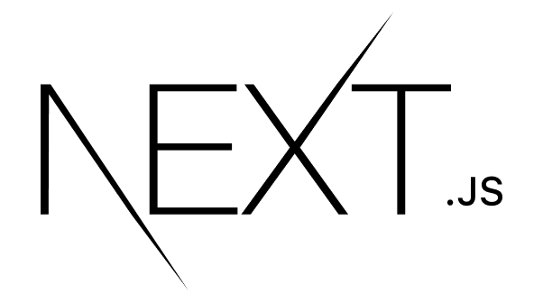
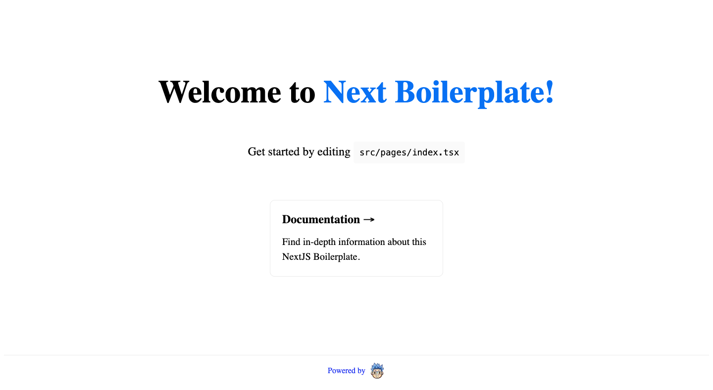
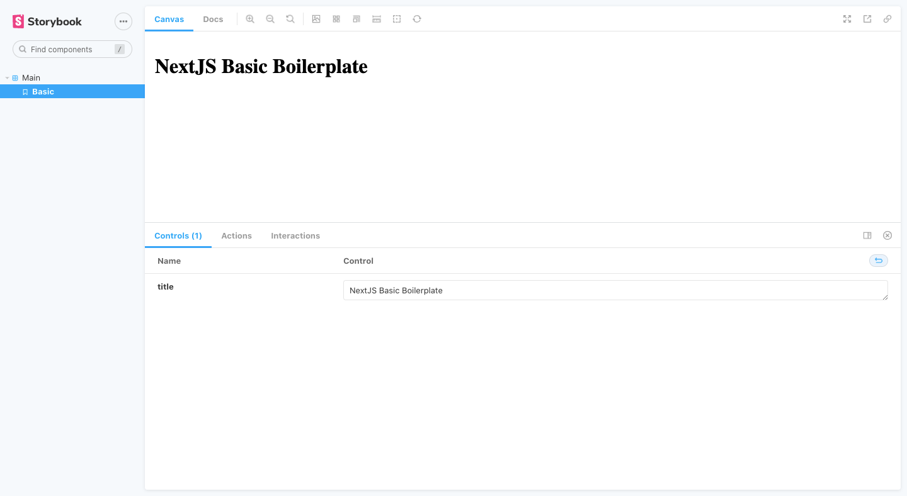
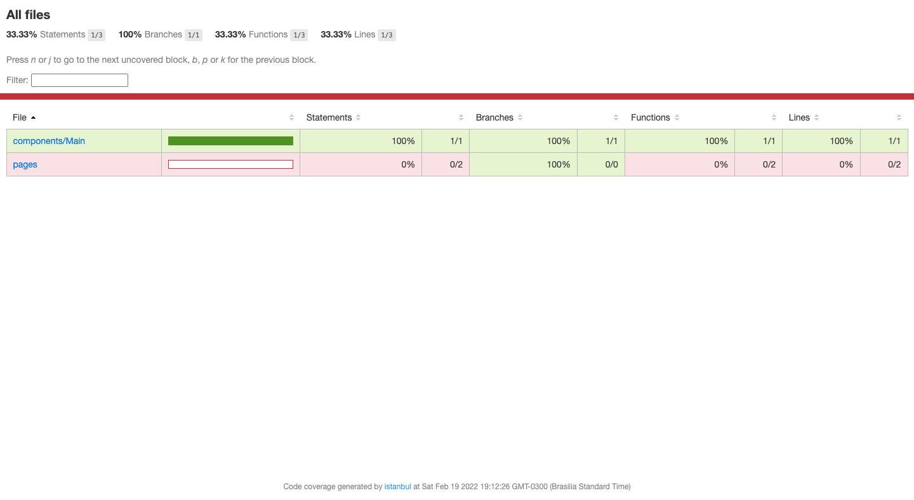

<h1 align="center">
  <a href="https://github.com/csorlandi/next-boilerplate">
    
  </a>
</h1>

<p align="center">Next Boilerplate was created to be a template for starting NextJS projects with pre-configured settings like Linters, Test Setup, Storybook and Commit Hooks.</p>

<p align="center">
  <a href="https://github.com/csorlandi">
    
  </a>

  

  

  
</p>

<p align="center">
  
  
  
</p>

---

## Table of Contents

<ul>
  <li><a href="#-features">Features</a></li>
  <li><a href="#-next-step-challenges">Chalenges</a></li>
  <li><a href="#-getting-started">Getting Started</a></li>
  <li><a href="#-contributing">Contributing</a></li>
  <li><a href="#-support">Support</a></li>
  <li><a href="#-license">License</a></li>
</ul>

---

## 📋 Features

### Build with

- [ReactJS](https://reactjs.org/) - A JavaScript library for building user interfaces.
- [Typescript](https://www.typescriptlang.org/) - TypeScript is an open-source language which builds on JavaScript, one of the world’s most used tools, by adding static type definitions.
- [NextJS](https://nextjs.org/) - Next.js gives you the best developer experience with all the features you need for production: hybrid static & server rendering, TypeScript support, smart bundling, route pre-fetching, and more. No config needed.
  - [Next PWA](https://github.com/shadowwalker/next-pwa) - Zero config PWA plugin for Next.js, with workbox 🧰
- [Storybook](https://storybook.js.org/) - Storybook is an open source tool for building UI components and pages in isolation. It streamlines UI development, testing, and documentation.
- [React Testing Library](https://testing-library.com/) - Simple and complete testing utilities that encourage good testing practices.
- [Jest](https://jestjs.io/) - Jest is a delightful JavaScript Testing Framework with a focus on simplicity.
- [ESLint](https://eslint.org/) - ESLint is a tool for identifying and reporting on patterns found in ECMAScript/JavaScript code.
- [Prettier](https://prettier.io/) - Prettier is an opinionated code formatter. It enforces a consistent style by parsing your code and re-printing it with its own rules that take the maximum line length into account, wrapping code when necessary.
- [Editor Config](https://editorconfig.org/) - EditorConfig helps maintain consistent coding styles for multiple developers working on the same project across various editors and IDEs.
- [Husky](https://typicode.github.io/husky/#/) - Husky improves your commits and more 🐶 woof!
- [Lint Staged](https://github.com/okonet/lint-staged) - Run linters against staged git files and don't let 💩 slip into your code base!

---

## ⚔ Next Step Challenges

- [ ] Dockerize the project;
- [ ] Configure Deploy on Vercel;
- [ ] Configure CI/CD to GCP;
- [ ] Create branches to configure aditional features like:
  - [ ] Styled Components
  - [ ] Tailwind CSS
  - [ ] GraphQL
  - [ ] Some CMS
- [ ] Fix Lint Staged error with CSS files

---

## 🚀 Getting Started

### Prerequisites

- To run any ReactJS application you need to configure the environment on your machine.

- Setting the environment is a simple process, so it's recommended to follow the [NodeJS documentation](https://nodejs.org/en/), and if you want, install Yarn as Package Manager instead of NPM.

### Clone

- Clone this repo to your local machine using:

```
git clone https://github.com/csorlandi/next-boilerplate.git
```

### Setup

- Install project dependencies;

  ```javascript
    yarn install
    // or
    npm install
    ```

#### Run Development Mode

- Run project in development mode;

  ```javascript
    yarn dev
    // or
    npm run dev
    ```

- Open a new tab on your browser and access `http://localhost:3000`;

- Be Happy! 😆

#### Run Production Mode

- Build the project in production mode;

  ```javascript
    yarn build
    // or
    npm run build
    ```

- Run builded project;

  ```javascript
    yarn start
    // or
    npm run start
    ```

- Open a new tab on your browser and access `http://localhost:3000`;

- Be Happy! 😆

#### Run Storybook in Development Mode

- Run storybook in development mode;

  ```javascript
    yarn storybook
    // or
    npm run storybook
    ```

- Open a new tab on your browser and access `http://localhost:6006`;

- Be Happy! 😆

#### Run Storybook in Production Mode

- Run storybook in production mode;

  ```javascript
    yarn build-storybook
    // or
    npm run build-storybook
    ```

- The command above create `storybook-static` folder;

- To see the result, open `storybook-static/index.html` file on your browser;

- Be Happy! 😆

#### Run Project Tests

- Run project tests watching all changes;

  ```javascript
    yarn test:watch
    // or
    npm run test:watch
    ```

- The command above show on terminal the tests results and code coverage;

- To see code coverage static page, open `coverage/lcov-report/index.html` file on your browser;

- Be Happy! 😆

---

## 🤔 Contributing

> To get started...

### Step 1

- 🍴 Fork this repo!

### Step 2

- 👯  Clone this repo to your local machine using `git clone https://github.com/csorlandi/next-boilerplate.git`

### Step 3

- 🎋  Create your feature branch using `git checkout -b my-feature`

### Step 4

- ✅  Commit your changes using `git commit -m 'feat: My new feature'`;

### Step 5

- 📌  Push to the branch using `git push origin my-feature`;

### Step 6

- 🔃  Create a new pull request

After your Pull Request is merged, can you delete your feature branch.

---

## 📌 Support

Reach out to me at one of the following places!

- Linktree at [@csorlandi](https://linktr.ee/csorlandi)
- Linkedin at [Claudio Orlandi](https://www.linkedin.com/in/csorlandi/)
- Youtube at [Claudio Orlandi](https://www.youtube.com/csorlandi)

---

## 📝 License


This project is licensed under the MIT License - see the [LICENSE](LICENSE) file for details.

---

Made with 💙  Enjoy it!
